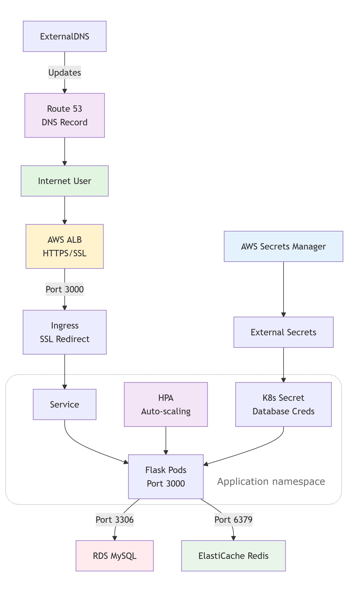

# Overview

This section contains all Kubernetes manifests required to deploy and expose the application on Amazon EKS using Helm.

It includes:
- Flask application Deployment configuration
- Horizontal Pod Autoscaler (HPA) for automatic scaling
- Cluster-internal Service for pod networking
- HTTPS Ingress using AWS Application Load Balancer (ALB)
- External Secrets configuration to fetch database credentials from AWS Secrets Manager
---

<p align="center">
  
</p>

## Application Deployment - flask-app-deployment.yml

- Deploys the Flask application as Kubernetes pods
- Uses Helm values for configuration
- Connects the app to Amazon RDS (MySQL) and ElastiCache (Redis)
- Applies security best practices
- Supports autoscaling using HPA

### Deployment
Creates and manages Flask application pods in the specified namespace.

- Uses labels for pod selection
- HPA controls the number of replicas (replica count is commented)

Container Image
```yaml
image: repository:tag
````

* Image is pulled from Docker Hub
* Tag is updated automatically via CI/CD
* Same image is reused across environments

Ports

```yaml
containerPort: 3000
```

* Flask app listens on port 3000 inside the container
* Service and Ingress route traffic to this port

### Health Checks (Probes)

Prevents broken pods from receiving traffic & improves availability during deployments

* Liveness Probe: Checks `/status` & restarts the container if the app becomes unhealthy
* Readiness Probe: Checks `/status` and ensures traffic is sent only when the app is ready

### Security Context

It Reduces attack surface. Follows Kubernetes and EKS security best practices. The container runs with strict security settings:

* Runs as non-root user
* No privilege escalation
* Read-only root filesystem
* All Linux capabilities dropped
* Uses default seccomp profile

### Resource Management

* Ensures fair resource usage
* Prevents one pod from consuming all node resources
* Required for autoscaling to work correctly

```yaml
requests:
  cpu: 50m
  memory: 128Mi
limits:
  cpu: 100m
  memory: 256Mi
```

### Environment Variables

Sensitive data is not stored in plain text

Env variables are configured using Helm values and Kubernetes Secrets:

* Database host (RDS)
* Redis host (ElastiCache)
* Ports for MySQL and Redis

Secrets are loaded securely using:

```yaml
envFrom:
  - secretRef
```

### Temporary Storage

Needed because root filesystem is read-only. They are Used for temporary runtime files

```yaml
emptyDir volume mounted at /tmp
```
---

## Flask Application Autoscaling (HPA) - flask-app-hpa.yml

This defines a Kubernetes Horizontal Pod Autoscaler (HPA) for the Flask application deployed using Helm.

The HPA automatically adjusts the number of Flask pods based on CPU and memory usage.

---

## Flask Application Service - flask-app-service.yml

This file defines a Kubernetes Service for the Flask application.
The Service provides a stable network endpoint to access Flask pods inside the cluster.

---

## Flask HTTPS Ingress (AWS ALB)

This Ingress exposes the Flask application to the internet using an AWS Application Load Balancer with HTTPS. It is deployed using a Helm template and is managed by the AWS Load Balancer Controller.

- The ALB is created as internet-facing and listens on both HTTP (80) and HTTPS (443).  
- HTTP traffic is redirected to HTTPS using an ALB redirect action.

- TLS is terminated at the ALB using an ACM certificate.  
- A modern SSL policy is enforced for secure communication.

- The ALB uses IP target mode, so traffic is routed directly to pod IPs.  
- Health checks are performed on the `/status` endpoint to ensure only healthy pods receive traffic.

- Multiple Ingress resources can share the same ALB using a common group name.

- ExternalDNS automatically creates or updates the Route 53 DNS record for the application domain and points it to the ALB.

- The Ingress is handled by the `alb` ingress class, ensuring it is processed by the AWS Load Balancer Controller.

- Routing rules match the application domain.  
 * HTTP requests are redirected to HTTPS.  
 * HTTPS requests are forwarded to the Flask Service.  
 * The Service load-balances traffic across the Flask pods.

Traffic flow:
User → Route 53 → ALB → Flask Service → Flask Pods

---

## Flask Application Secrets (External Secrets)

This manifest creates Kubernetes secrets using External Secrets Operator.

Secrets are fetched from AWS Secrets Manager through a ClusterSecretStore.

The ExternalSecret resource runs in the application namespace and creates a Kubernetes Secret named `flask-app-secret`.

Secrets are refreshed every 10 seconds to keep values in sync with AWS.

The secret store reference points to `aws-secret-store`, which is configured at cluster level.

The created Kubernetes Secret is owned by this ExternalSecret and is retained even if the ExternalSecret is deleted.

Database credentials are pulled from a single AWS Secrets Manager secret.
- `DATABASE_USER` is mapped from the `username` field
- `DATABASE_PASSWORD` is mapped from the `password` field

These secrets are later consumed by the Flask Deployment using `envFrom`.

Flow: 

AWS Secrets Manager → External Secrets Operator → Kubernetes Secret → Flask Pods

---
